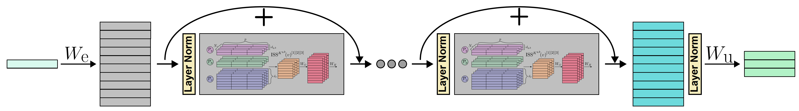
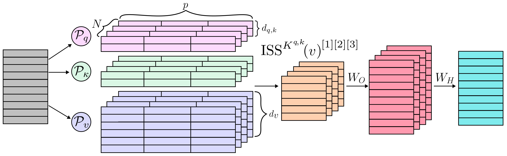

# ELISSABETH
Extended Learnable Iterated Sums Signature Architecture

Elissabeth is a deep learning sequence-to-sequence model consisting of LISS layers.

## LISS Layer
A single LISS layer computes weighted iterated sums with learnable parameters.

## sainomore
The package sainomore implements **Elissabeth** and a pipeline for deep learning around it. We use
`pytorch` for implementing all algorithms and train our models with the help of
`pytorch-lightning`. Additionally, we use `wandb`for logging our data online. Our package
implements specific callbacks for managing the logging. We developed a complex hooking mechanism
for accessing parameters in our models.

### Installation

We recommend to use [Poetry](https://python-poetry.org/) for installing and testing sainomore.

    $ git clone https://github.com/irkri/elissabeth
    $ cd elissabeth
    $ poetry install          (or: $ python -m pip install -e .)

Without cloning the repository, use instead:

    $ pip install git+https://github.com/irkri/elissabeth

### Experiments

The [projects](projects) folder contains some experiments we tested Elissabeth thoroughly on.

### Short module description
- `sainomore.elissabeth` implements everthing needed to make a flexible general **Elissabeth**
  model work
    - `sainomore.elissabeth.elissabeth` contains code for the outer model, consisting of embedding,
      multiple LISS layers and unembedding
    - `sainomore.elissabeth.liss` implements the LISS layer and a LISS level, which computes
      iterated sums of one specific depth (word length)
    - `sainomore.elissabeth.lissa` implements the arctic LISS layer
    - `sainomore.elissabeth.lissb` implements the bayesian LISS layer
    - `sainomore.elissabeth.qkv` implements the query, key and value projections
    - `sainomore.elissabeth.weighting` implements all kernels available for LISS layers
- `sainomore.models` is a convenience module containing code for a simple MLP and Transformer
  implementation
- `sainomore.xai` implements methods vor analyzing a trained **Elissabeth** model
    - `sainomore.xai.tools` contains methods for extracting data from the model
    - `sainomore.xai.plotting` contains methods for plotting the extracted data
    - `sainomore.xai.watcher` implements the `ElissabethWatcher`, which is a convenience class for
      analyzing a specific model
- `sainomore.base` implements the base classes for our models
- `sainomore.callback` implements callbacks used for watching a training run
- `sainomore.data` implements `pytorch-lightning` data modules
- `sainomore.hooks` contains code for sainomore hooks
- `sainomore.lightning` implements `pytorch-lightning` modules
- `sainomore.positional` implements positional encoding techniques

Some [tests](tests) are available for LISS layers and kernels.