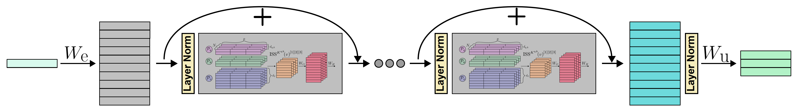
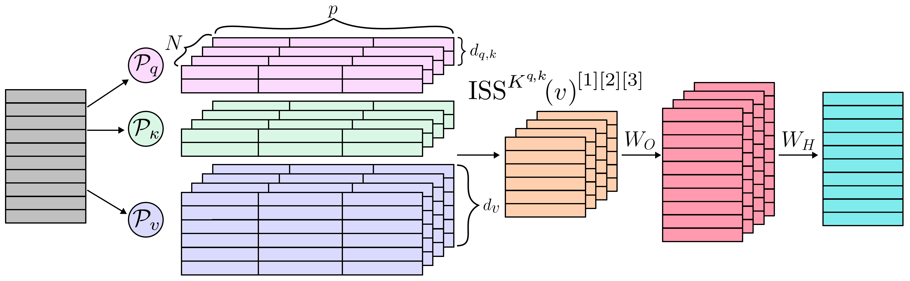

# ELISSABETH
Extended Learnable Iterated Sums Signature Architecture

Elissabeth is a deep learning sequence-to-sequence model consisting of LISS layers.

## LISS Layer
A single LISS layer computes weighted iterated sums with learnable parameters.

A LISS level of depth $p$ computes, in a semiring (reals, max-plus "arctic", log or Viterbi),

$$\mathrm{ISS}_t = \bigoplus_{t_1 < \dots < t_p \le t} \ \bigotimes_{l=1}^{p} v_l(x_{t_l}) \otimes \kappa_l(t_{l+1}, t_l), \qquad t_{p+1} = t,$$

with learned values $v_l$ and learned kernels $\kappa_l$ (exponential decay, $\bigoplus_r e^{q_r-k_r}$,
a product of cosines). Every kernel is a short semiring sum of separable terms, so a level is $p$
scans and costs $O(T)$. By default a layer is bidirectional: a second LISS reads the sequence
backwards.

## Installation

    $ git clone https://github.com/irkri/elissabeth
    $ cd elissabeth
    $ python -m pip install -e ".[analysis,online,tropical,test]"

## Usage

A model is described by one YAML file: the model, the task it trains on and the trainer.

    $ cd project
    $ python train.py configs/lookup.yaml
    $ python train.py configs/lookup.yaml -o model.liss.semiring=arctic -o trainer.epochs=100
    $ python train.py configs/copying.yaml --online team/elissabeth
    $ python analysis/kernels.py run_0001 --total

The combinatorial tasks of the Tropical Attention benchmark (Hashemi et al., NeurIPS 2025) are
generated by the benchmark's own code, from a clone of
[Baran-phys/Tropical-Attention](https://github.com/Baran-phys/Tropical-Attention):

    $ python train.py configs/tropical/base.yaml -oc configs/tropical/knapsack.yaml
    $ python analysis/tropical_eval.py <run>      # in distribution, length, value and noise OOD

In Python, `Elissabeth(config.model, input_dim, output_dim)` builds the network from a
`ElissabethConfig`.

## Layout

- `elissabeth/elissabeth.py`: the model, `embedding -> n_layers x [mixer, SwiGLU] -> norm ->
  unembedding`
- `elissabeth/liss/`: the LISS layer (`layer.py`), its kernels (`kernels.py`), the value, query and
  key projections (`projection.py`) and the semiring scans (`semiring.py`)
- `elissabeth/attention.py`: softmax attention with RoPE (causal or not), the transformer baseline
- `elissabeth/data.py`: the tasks (copying, cyclic, lookup, text) and the data module
- `elissabeth/tropical.py`: the Tropical Attention benchmark as a task
- `elissabeth/lightning.py`: the training module and callbacks
- `elissabeth/config.py`: the run config (`model`, `dataset`, `trainer`), YAML loading, overrides
- `project/`: `train.py`, the task configs and the analysis scripts
- `tests/`: the LISS recursion against brute force, and the model around it